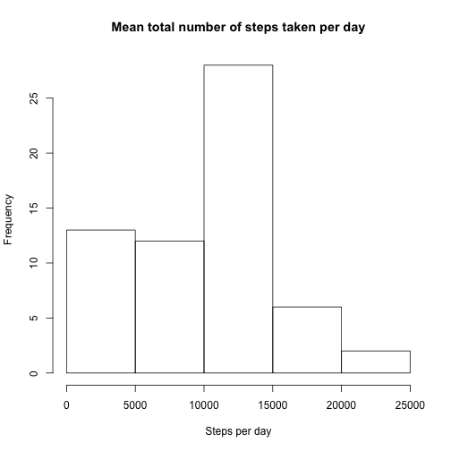
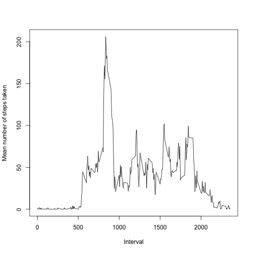
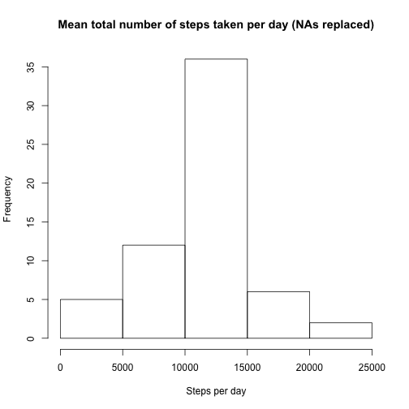
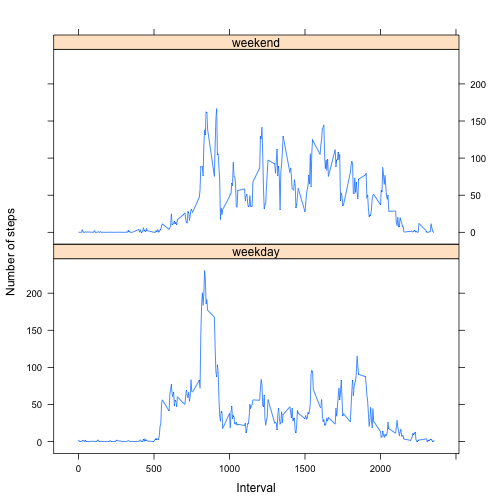

## Loading and preprocessing the data

Load the data into memory. We assume the .csv file is in the current working directory.

```r
activity <- read.csv("activity.csv")
```

Load the libraries that will be used for processing the data.


```r
# load libraries
library(dplyr)
library(lattice)
```

## What is mean total number of steps taken per day?

Note: Missing values are ignored for this part of the assignment. 


```r
# calculate the total number of steps per day, ignoring NAs
total <- group_by(activity, date) %>% summarize(steps = sum(steps, na.rm = TRUE)) 

# plot histogram
hist(total$steps, main = "Mean total number of steps taken per day", xlab = "Steps per day")
```

 

```r
# calcualte the mean steps per day
meanSteps <- mean(total$steps, na.rm = TRUE)
meanSteps
```

```
## [1] 9354.23
```

```r
# calcualte the mean and median steps per day
medianSteps <- median(total$steps, na.rm = TRUE)
medianSteps
```

```
## [1] 10395
```

The **mean** number of steps per day is **9354.2295082**.

The **median** number of steps per day is **10395**.


## What is the average daily activity pattern?


```r
# compute the mean number of steps for each daily time interval
meanAtInterval <- by(activity$steps, activity$interval, mean, na.rm = TRUE)

# get the intervals as a list
intervals <- levels(factor(activity$interval))

# create a line plot
plot(y = meanAtInterval, x = as.integer(intervals), type = "l",
     xlab = "Interval", ylab = "Mean number of steps taken")
```

 


Which 5-minute interval, on average across all the days in the dataset, contains the maximum number of steps?


```r
maxInterval <- intervals[which.max(meanAtInterval)]
maxInterval
```

```
## [1] "835"
```

Interval **835** has the largest 5-minute mean across all days.

## Imputing missing values

Note that there are a number of days/intervals where there are missing values (coded as NA). The presence of missing days may introduce bias into some calculations or summaries of the data.

Calculate and report the total number of missing values in the dataset (i.e. the total number of rows with NAs)


```r
# create a logical vector of rows that contain NAs
missingVals <- !complete.cases(activity)

# count how many rows contain NAs by summing the logical vector values
totalNumRowsWithNAs <- sum(missingVals)
totalNumRowsWithNAs
```

```
## [1] 2304
```

There are 2304 rows with NAs in the dataset.

The strategy for filling in all of the missing values in the dataset is simple: for any missing step values, use the mean for that 5-minute interval. A new dataset is created, that is equal to the orginal but has the missing data filled in


```r
# Get the indices of rows with NAs
indicesOfEmptyRows <- which(!complete.cases(activity))

# Get the interval label for rows with NAs
missingIntevals <- (as.character(activity$interval[indicesOfEmptyRows]))

# For any intervals with NAs, get the mean for that 5-minute interval
gapFill <- lapply(missingIntevals, function(x) { meanAtInterval[[x]]  } )

# create a copy of the activity dataset
filled <- activity

# replace the NA values in the new dataset with mean number of steps at that interval
filled$steps[indicesOfEmptyRows] <- gapFill

# convert to steps to numeric values
filled$steps <- as.numeric(as.character(filled$steps))
```

Make a histogram of the total number of steps taken each day and Calculate and report the mean and median total number of steps taken per day. Do these values differ from the estimates from the first part of the assignment? What is the impact of imputing missing data on the estimates of the total daily number of steps?


```r
# calculate the total number of steps per day in our newly filled in dataset
total <- group_by(filled, date) %>% summarize(steps = sum(steps, na.rm = TRUE)) 

# plot histogram
hist(total$steps, main = "Mean total number of steps taken per day (NAs replaced)", xlab = "Steps per day")
```

 

```r
# calcualte the mean steps per day
meanSteps <- mean(total$steps, na.rm = TRUE)
meanSteps
```

```
## [1] 10766.19
```

```r
# calcualte the mean and median steps per day
medianSteps <- median(total$steps, na.rm = TRUE)
medianSteps
```

```
## [1] 10766.19
```

The mean and median are now the same (10766.19). This is different to the orginal mean and median, and is most likely due to the large number of NA values that were replaced with mean 5-minute interval data.

## Are there differences in activity patterns between weekdays and weekends?

We now create a new factor variable in the dataset with two levels – “weekday” and “weekend” indicating whether a given date is a weekday or weekend day.


```r
# convert date values from factors to Dates
filled$date <- as.Date(filled$date, format = "%Y-%m-%d")

# create a new variable called "day", which indicated if the date is a weekday or weekend day
filled$day <- ifelse ( weekdays(filled$date) %in% c("Saturday", "Sunday"), "weekend", "weekday" )

# convert the day variable to a factor
filled$day <- as.factor(filled$day)
```

A panel plot containing a time series plot (i.e. type = "l") of the 5-minute interval (x-axis) and the average number of steps taken, averaged across all weekday days or weekend days (y-axis).


```r
result <- filled %>% group_by(day, interval) %>%
  summarise_each(funs(mean(., na.rm=TRUE)), -day, -interval, -date)

xyplot(result$steps ~ as.integer(result$interval) | result$day,
       layout = c(1,2), type = "l", xlab = "Interval",
       ylab = "Number of steps")
```

 
